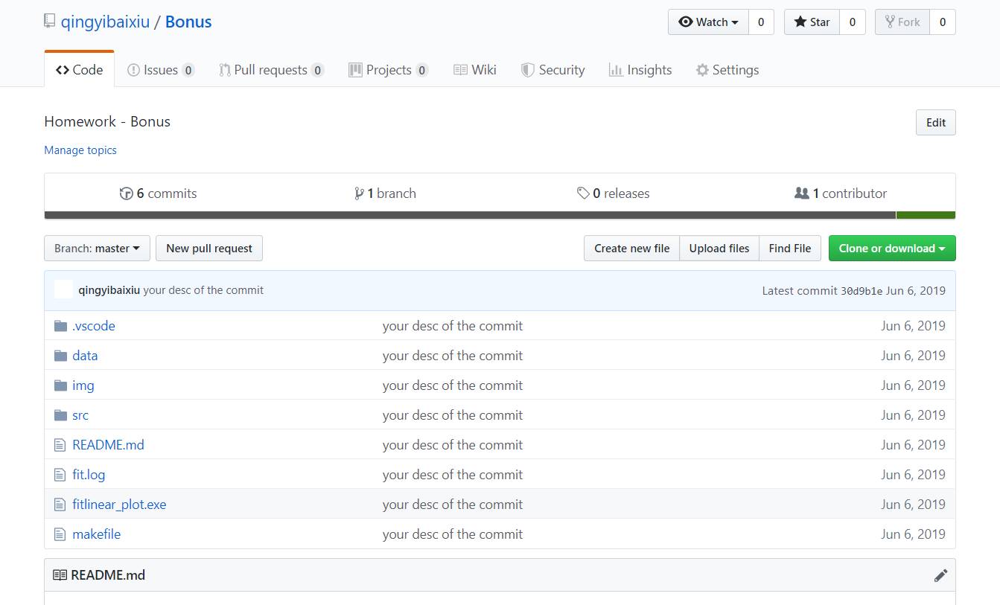

这次作业的要求分成两个部分：
第一部分是先读取springdata.csv数据文件，在此基础上使用GSL进行线性回归，然后使用Gnuplot来可视化线性回归的结果。第二部分是使用Git,Github进行
版本控制，将你的作业上传到你的Github上并且可以进行不断的更新。
所以我会从这两个部分来介绍我这次的作业：
一、
首先编写程序来读取.csv文件，代码如下所示:
```c
//读取csv文件
FILE *fp = NULL;
char *line,*record;
char buffer[1024];
int j = 0;
double a[100][10];
int i = 0;
if ((fp = fopen("./data/springdata.csv", "at+")) != NULL)
{
fseek(fp, 22, SEEK_SET);  
char delims[] = ",";
char *result = NULL;
while ((line = fgets(buffer, sizeof(buffer), fp))!=NULL)//当没有读取到文件末尾时循环继续
{
	record = strtok(line, ",");
	while (record != NULL)//读取每一行的数据
	{
		a[i][j] = atof(record);
		if (j == 1)  //只需读取前2列
		break;
		record = strtok(NULL, ",");
		j++;
		i++;
		}
		j = 0;
		}
		fclose(fp);
		fp = NULL;
		}
  
double x[i],y[i];
for(int m = 0; m < i; m++)
{
 x[m]=a[m+1][1]*9.81;
 y[m]=a[m][0];
  }
```
读取完数据后，使用gsl_fit_linear进行线性回归，代码如下:
```C
//fit_linear
int n = 19;

double c0, c1, cov00, cov01, cov11, sumsq;
 
gsl_fit_linear(x, 1, y, 1, n,
                 &c0, &c1, &cov00, &cov01, &cov11,
                 &sumsq);

printf ("best fit:  Y = %g + %g X\n", c0, c1);
printf ("covariance matrix:\n");
printf ("[ %g, %g\n  %g, %g]\n", cov00, cov01, cov01, cov11);
printf ("sumsq = %g\n", sumsq);
printf ("\n");
```
最后使用pipe连接Gnuplot输出图像，代码如下：
```C
//plot
FILE *pipe = popen("gnuplot -persist", "w");  // Open a pipe to gnuplot

if (pipe) 
{   
// If gnuplot is found
fprintf(pipe, "d(x) = k1+k2*x\n");
fprintf(pipe, "set datafile separator ','\n"); //datafile separator ','
fprintf(pipe, "fit d(x) './data/springdata.csv' using ($2*9.81):1 via k1,k2\n");
fprintf(pipe, "set term wx\n");         // set the terminal               
fprintf(pipe, "set xlabel '|Force| (Newtons)'\n");
fprintf(pipe, "set ylabel 'Distance (meters)'\n");
fprintf(pipe, "set title 'Measured Displacement of Spring'\n");
fprintf(pipe, "plot './data/springdata.csv' using  ($2*9.81):1 title '(Force,Distance)',\
'./data/springdata.csv' using ($2*9.81):(d($2*9.81)) title '',\
'./data/springdata.csv' using ($2*9.81):(d($2*9.81))  title 'Force=f(Distance)' with line ls 12\n");

fflush(pipe); //flush pipe
fprintf(pipe,"exit \n");   // exit gnuplot
pclose(pipe);    //close pipe
}

最后输出的图像如下：


二、
将作业上传到我个人的Github仓库，以便进行不断的更新。最终的网址和截图如下：
网址：
https://github.com/qingyibaixiu/Bonus
截图：
